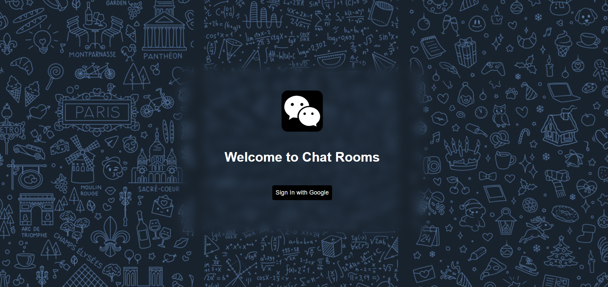
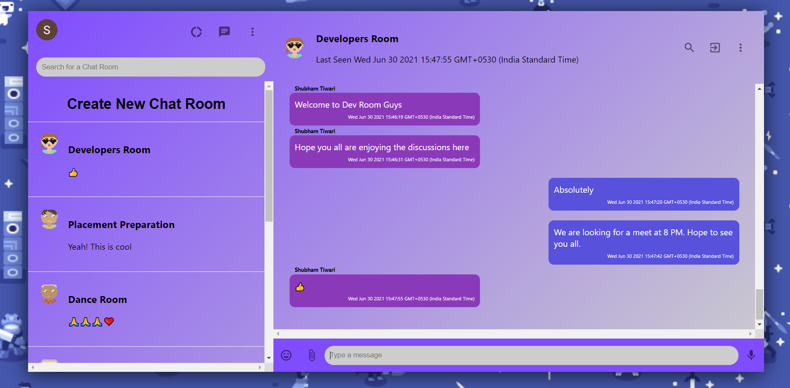
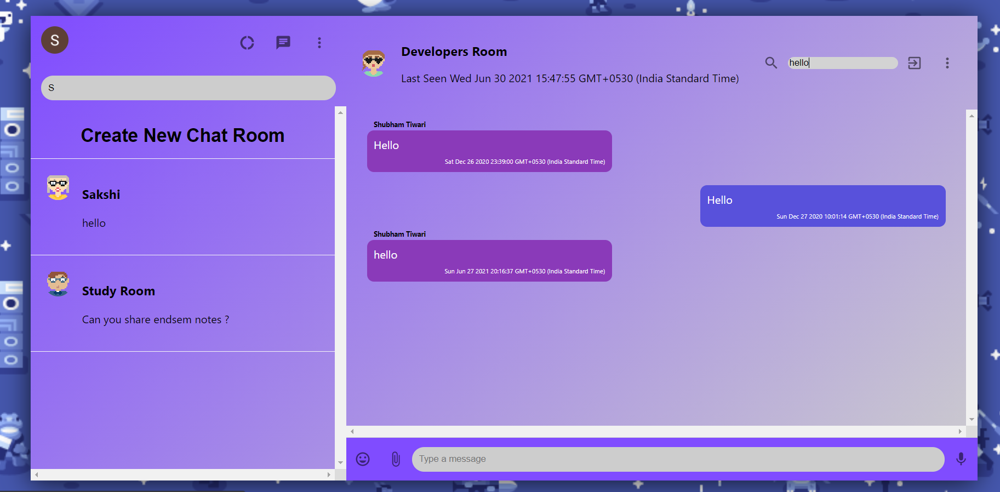
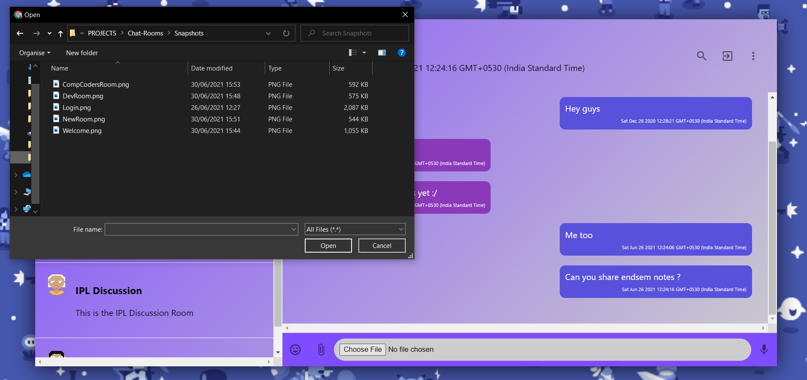
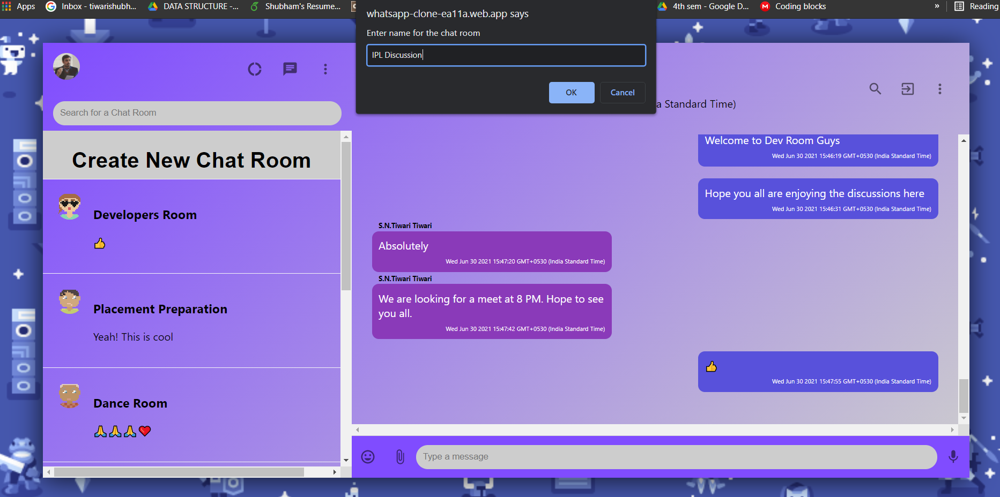
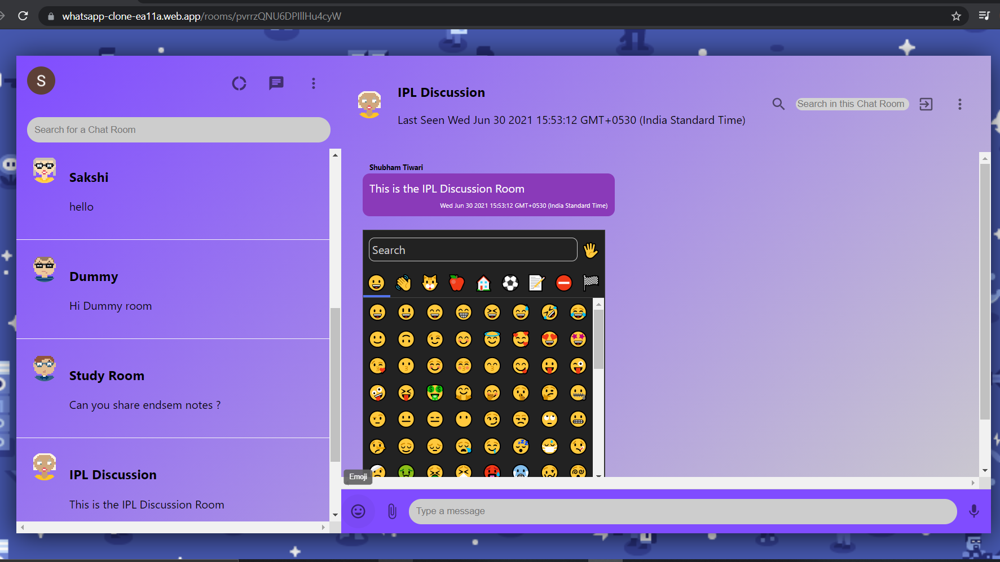

# Chat Rooms 2.0 
An Application for Chats and Discussions - Updated in June 2021

#### Deployed Link: https://whatsapp-clone-ea11a.web.app/

   

## Description
This Application is designed to provide a platform for discussions and query resolution regarding topics like Development, Competitive Coding, Dance or Studies in general etc. It has been designed on the lines of the WhatsApp Clone.

## Salient features:
  1. Login and Logout through Google Authentication.
  2. Dedicated Chat Rooms for discussions and query resolution.
  3. Features to create new chat rooms, search chat rooms, search in chats and upload files.
  4. Animations in the background.
  5. Emoji Picker for chats.

## This Application is made using:
  1. React.Js
  2. Firebase

## To run the repository on the system:
  1. Clone the repository using "git clone https://github.com/tiwarishubham635/Chat-Rooms.git"
  2. Use "npm install" to install node_modules required.
  3. Use "npm start" to run the development server  

## Snapshots of the Website
* ### Login Page

   
   

* ### Welcome Page (Just After Login)

   
   

* ### Developers Chat Room

   
   

* ### Search Option and Tooltips

   
   
   

* ### Upload files

   
   
   

* ### Making New Chat Room

   
   

* ### IPL Discussion Chat Room

   
   

* ### Emoji Picker

   
   
