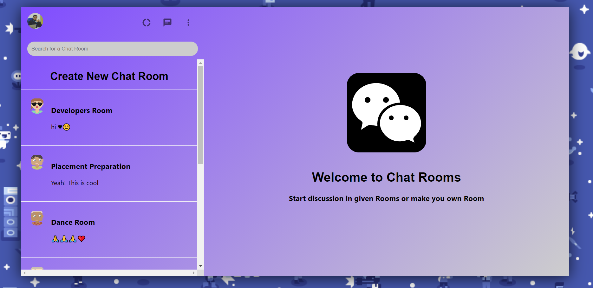

# Chat Rooms 
An Application for Chats and Discussions

## Demo
https://whatsapp-clone-ea11a.web.app/

## Description
This Application is designed to provide a platform for discussions and query resolution regarding topics like Development, Competitive Coding, Dance or Studies in general etc. It has been designed on the lines of the WhatsApp Clone.

## Salient features:
  1. Login through Google Authentication.
  2. Dedicated Chat Rooms for discussions and query resolution.
  3. Feature to add new chat rooms.
  4. Animations in the background.
  5. Emoji Picker for chats.
  6. Complete chatting application.

## This Application is made using:
  1. React.Js
  2. Firebase

## To run the repository on the system:
  1. Clone the repository using "git clone https://github.com/tiwarishubham635/Chat-Rooms.git"
  2. Use "npm install" to install node_modules required.
  3. Use "npm start" to run the development server  

# Snapshots of the Website
* Login Page

   
   

* Welcome Page (Just After Login)

   
   

* Developers Chat Room

   
   

* Dance Chat Room

   
   

* Study Chat Room

   
   

* Making New Chat Room

   
   

* Competitive Coders Chat Room

   
   

* Emoji Picker

   
   
